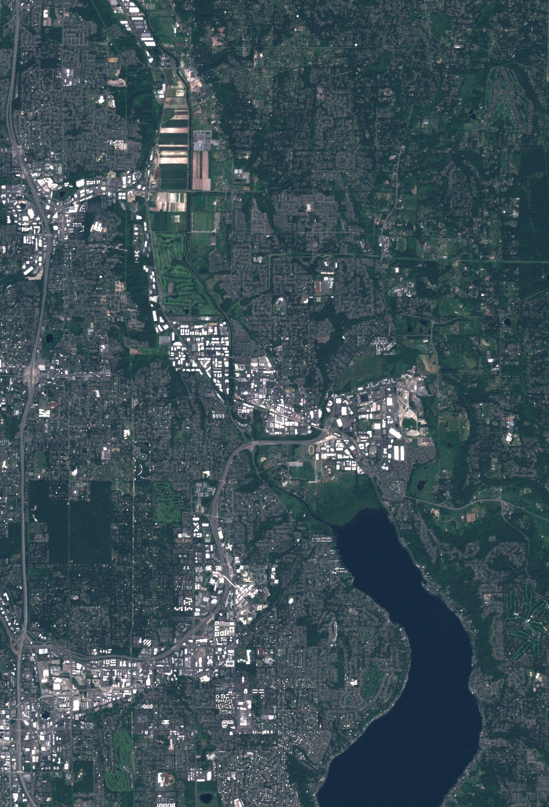
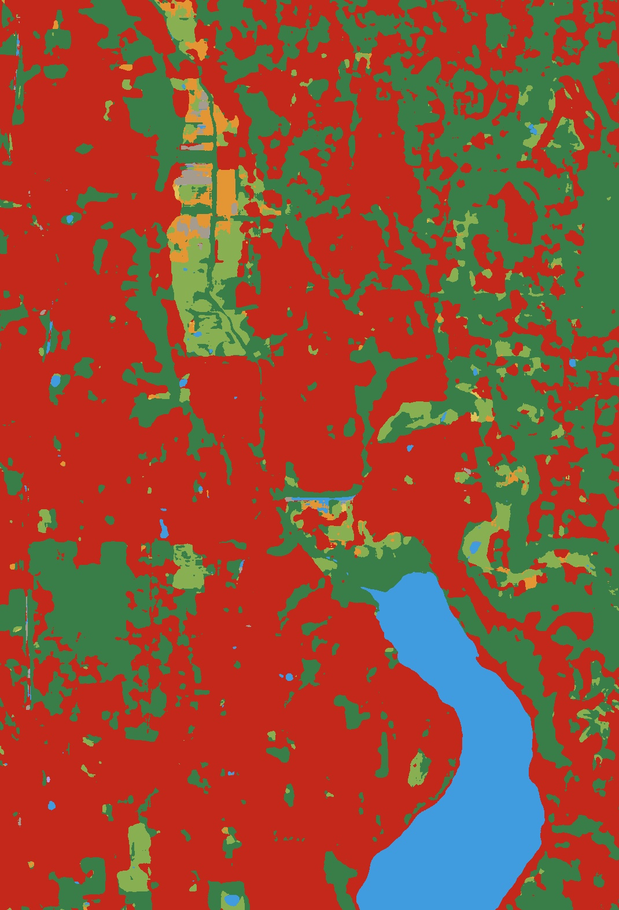
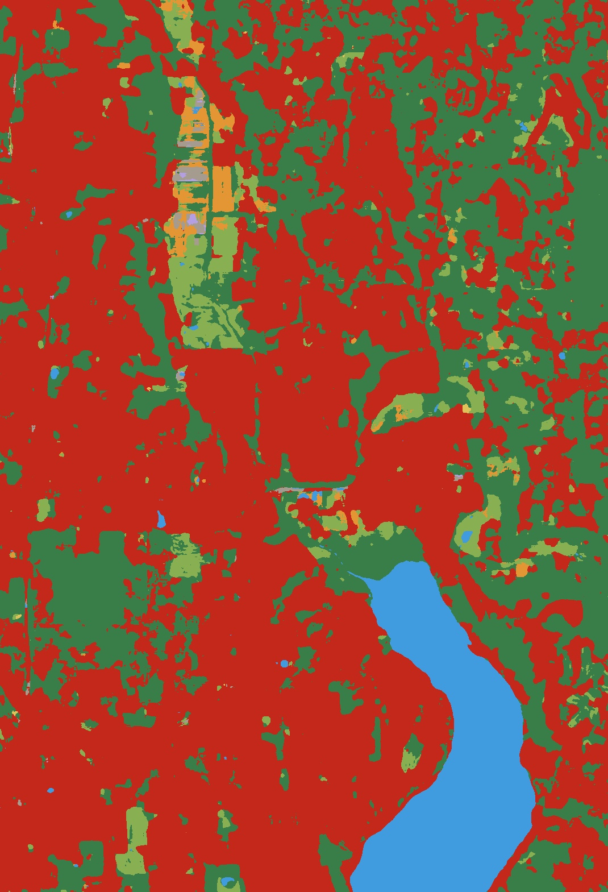

# Dynamic World — PyTorch

**Jump to: [Quick start](#quick-start) | [TensorFlow conversion](#tensorflow-conversion) | [Inference on new imagery](#inference-on-new-imagery) | [Files](#files) | [Citation](#citation)**

A PyTorch port of [Google's Dynamic World model](https://github.com/google/dynamicworld) — the 10-meter near-real-time global land cover classifier from [Brown et al., 2022 (Nature Scientific Data)](https://www.nature.com/articles/s41597-022-01307-4).

The official model is published as a TensorFlow SavedModel. This repo provides:

1. A clean, dependency-light **PyTorch reimplementation** of the forward (inference) graph (one file: [`dynamic_world.py`](dynamic_world.py)) — only `torch` required
2. **Pretrained weights** ([`weights/dynamic_world.pt`](weights), ~957 KB) converted from the official TF checkpoint; outputs are **bit-exact** to the SavedModel (max |Δ| ≈ 4 × 10⁻⁶)
3. A **converter script** ([`convert_weights.py`](convert_weights.py)) that regenerates the weights from a fresh clone of the upstream repo, with optional numerical verification
4. A **local GeoTIFF inference script** ([`inference.py`](inference.py)) for Sentinel-2 scenes, plus an [Earth Engine helper](ee_export_example.py) for exporting matched S2 + official Dynamic World rasters

> ℹ️ **Not affiliated with Google.** The original Dynamic World is from Google, released under Apache 2.0. This port is also Apache 2.0 — see [`LICENSE`](LICENSE).


<p align="center">
  
  
  
</p>

**Figure 1.** Redmond, WA crop from Sentinel-2 L1C scene `20240625T185941_20240625T190720_T10TET`. **Left:** Sentinel-2 true-color RGB. **Middle:** the official Dynamic World V1 label raster pulled from Earth Engine. **Right:** the same scene classified by this PyTorch port using the bundled converted weights. Both label panels use the official Dynamic World class colors.

**Note** that there _is_ a difference between the model output (93.6% of class values are the same in this particular scene), and the exported Dynamic World predictions from Earth Engine (EE). Local inference is bit-exact to the public SavedModel, but the predictions from EE could differ because of a different production model (the EE asset reports `dynamicworld_algorithm_version=3.5`, but it is unclear what version the saved model from the official repo is) and inference process: QA/cloud masking, preprocessing/resampling, tiling/context, and any production revision not explicitly versioned in the public SavedModel.

## Quick start

```bash
git clone https://github.com/calebrob6/dynamic_world_pytorch.git
cd dynamic_world_pytorch
pip install -r requirements.txt
```

```python
import torch
from dynamic_world import DynamicWorld, CLASS_NAMES

model = DynamicWorld.from_pretrained("weights/dynamic_world.pt").eval()

# x: a normalized 9-band Sentinel-2 patch as (B, 9, H, W) float32
x = torch.randn(1, 9, 256, 256)
with torch.no_grad():
    logits = model(x)              # (1, 9, H, W)
    probs = logits.softmax(dim=1)  # per-pixel class probabilities
    pred = probs.argmax(dim=1)     # (1, H, W) class indices in [0..8]

print(CLASS_NAMES[pred[0, 128, 128].item()])
```

The model is fully convolutional, so any `(H, W)` ≥ 4 works.


## TensorFlow conversion

The conversion preserves the model's outputs to within float32 rounding noise. Reproduce with:

```bash
git clone https://github.com/google/dynamicworld.git /tmp/dynamicworld
pip install tensorflow  # for reading the SavedModel
python convert_weights.py --tf-model /tmp/dynamicworld/model/forward --verify
```

Expected output:

```
Numerical verification:
  TF  output mean/std = -4.7081 / 0.8728
  PT  output mean/std = -4.7081 / 0.8728
  max |Δ|             = 3.8147e-06
  mean |Δ|            = 6.4635e-07
  ✅ Bit-exact match (within float32 rounding noise)
```

## Inference on new imagery

Dynamic World expects Sentinel-2 L1C input as 9-band patches in this order: `B2, B3, B4, B5, B6, B7, B8, B11, B12` (also exposed as `SENTINEL2_BANDS` in [`dynamic_world.py`](dynamic_world.py)). All bands must be bilinearly resampled to a 10 m grid. The model itself takes already-normalized `(B, 9, H, W)` float32 tensors, but [`inference.py`](inference.py) applies Dynamic World's per-band log-percentile normalization (`normalize_sentinel2`) for you — so you only need to hand it a raw 9-band TOA-reflectance GeoTIFF in the band order above.

Install the extra GeoTIFF/Earth Engine dependencies:

```bash
pip install rasterio earthengine-api
```

Export a Sentinel-2 L1C scene and the matching official Dynamic World outputs:

```bash
python ee_export_example.py --auth --project YOUR_EE_PROJECT  # one-time auth
python ee_export_example.py --project YOUR_EE_PROJECT  # starts Drive export tasks
```

Download the three Drive exports into `data/`:

```text
data/S2_L1C_DWbands_<S2_ID>.tif
data/DynamicWorld_V1_<S2_ID>_label.tif
data/DynamicWorld_V1_<S2_ID>_probs.tif
```

Run local PyTorch inference on the exported S2 GeoTIFF:

```bash
python inference.py --input data/S2_L1C_DWbands_<S2_ID>.tif
```

This writes `data/PyTorch_DynamicWorld_<S2_ID>_label.tif` and `..._probs.tif` next to the input.

### Comparing output against Earth Engine Dynamic World output

If the matching official `DynamicWorld_V1_<S2_ID>_{label,probs}.tif` files are in the same directory, `inference.py` automatically prints probability and label agreement metrics. Use `--official-label` and `--official-probs` to compare against files elsewhere. Run `python inference.py --help` for the full set of options (device selection, tiled inference for memory-constrained machines, custom output prefixes, etc.).

## Files

| File                | Purpose                                                                     |
|:--------------------|:----------------------------------------------------------------------------|
| `dynamic_world.py`  | The model — single file, only `torch` required                              |
| `convert_weights.py`| TF SavedModel → PyTorch state dict converter (requires `tensorflow`)        |
| `inference.py`      | Run local GeoTIFF inference and compare against exported Dynamic World rasters |
| `ee_export_example.py` | Earth Engine export/download example for matching S2 L1C and Dynamic World rasters |
| `weights/dynamic_world.pt` | Converted pretrained weights (~957 KB)                                |
| `requirements.txt`  | Runtime deps (`torch`, `numpy`)                                             |
| `LICENSE`           | Apache 2.0                                                                  |

## Citation

If you use Dynamic World in your work, please cite the original paper:

```bibtex
@article{brown2022dynamic,
  title={Dynamic World, Near real-time global 10 m land use land cover mapping},
  author={Brown, Christopher F. and Brumby, Steven P. and Guzder-Williams, Brookie and Birch, Tanya and Hyde, Samantha Brooks and Mazzariello, Joseph and Czerwinski, Wanda and Pasquarella, Valerie J. and Haertel, Raphael and Ilyushchenko, Simon and others},
  journal={Scientific Data},
  volume={9},
  number={1},
  pages={251},
  year={2022},
  publisher={Nature Publishing Group},
  doi={10.1038/s41597-022-01307-4}
}
```

If you use this PyTorch port specifically, please also cite this repository:

```bibtex
@misc{robinson2026dynamicworldpytorch,
  author       = {Robinson, Caleb},
  title        = {{Dynamic World} -- {PyTorch}: a {PyTorch} port of {Google}'s {Dynamic World} model},
  year         = {2026},
  howpublished = {\url{https://github.com/calebrob6/dynamic_world_pytorch}}
}
```

## License

Apache 2.0 — see [`LICENSE`](LICENSE). The pretrained weights derive from Google's release at https://github.com/google/dynamicworld and are redistributed under the same license per its terms.
